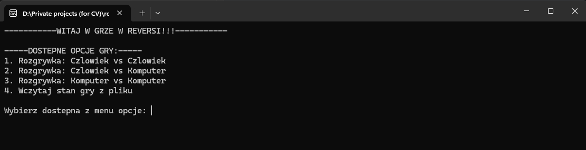
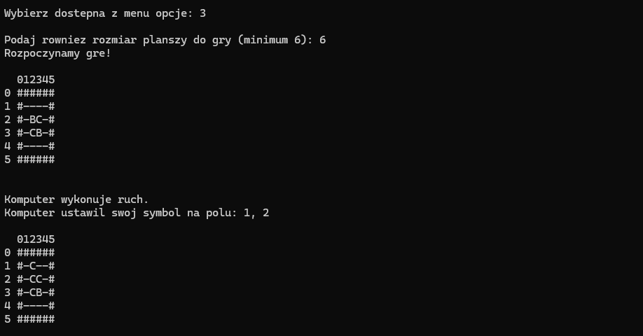
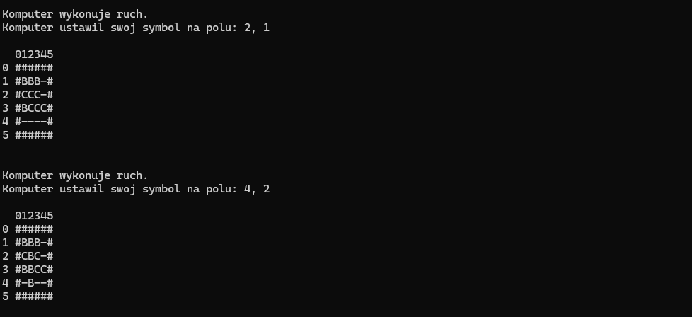
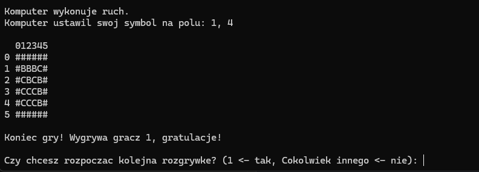
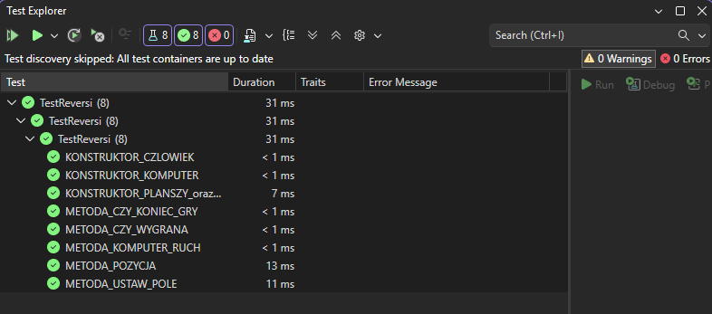

# IMPLEMENTACJA GRY "REVERSI" 🎮

To repozytorium zawiera moją implementację gry "Reversi" jako ostateczny projekt na zajęcia: "Programowanie obiektowe 1". Jest to prosta implementacja popularnej gry "Reversi" (zwanej również "Chińskimi szachami") w języku C++ w postaci aplikacji konsolowej.

  Poza samą grą są tutaj również zaimplementowane pryzkładowe testy jednostkowe, sprawdzające poprawność działania podstawowych funkcji gry w różnych sytuacjach. 📝

## Jak odpalić projekt/grę?
Wystarczy ściągnąć cały plik z repozytorium i uruchomić go w programie Visual Studio.
 Pojawi się okienko konsolowe z prostym menu gry oraz możliwością wybrania jednej z opcji.

## Przykładowe zrzuty ekranu 📷

* Screen z menu startowym gry
 

* Seria przykładowych screenów z przebiegu gry (Komputer vs Komputer)
 
 
 

* Screen z domyślnie zaimplementowanymi testami jednostkowymi.

 

## Więcej o grze reversi ℹ️
[Opis gry "Reversi" na Wikipedii](https://pl.wikipedia.org/wiki/Reversi)
